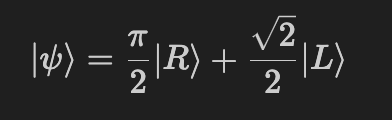
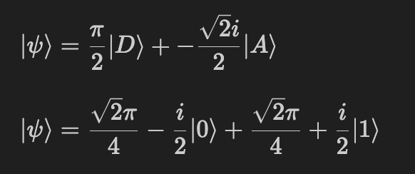
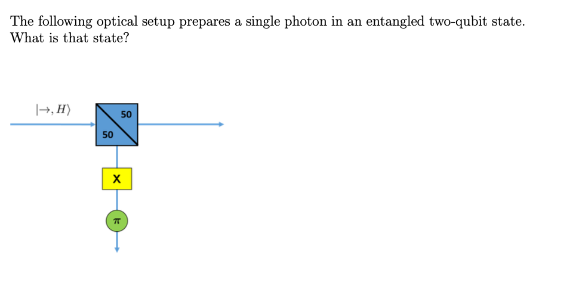
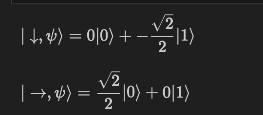

# Quantum Photon Simulation
This project provides a Python implementation for simulating quantum photons and applying various quantum gates. It utilizes the SymPy library for symbolic mathematics and the IPython display module for visualization.
## Prerequisites
To run this project, you need to have the following dependencies installed:

Python (version 3.x)
SymPy
NumPy
IPython

You can install the required packages using pip:
``` pip install sympy numpy ipython```
## Usage

1. Import the necessary classes and functions from the main Python script:
```from quantum_photon_simulation import Photon, beamSplitter, halfWavePlate```
2. Create a Photon instance with the desired polarization, amplitudes, and direction:
``` photon = Photon(polarization='HV', amplitudes=sp.Matrix([1, 0]), direction='-')```
The polarization parameter can be 'HV', 'DA', or 'RL' for horizontal/vertical, diagonal/anti-diagonal, or right/left circular polarization, respectively. The amplitudes parameter should be a SymPy Matrix object containing the amplitudes of the photon in the specified polarization basis. The direction parameter can be '-' or '|' to indicate the direction of the photon being sidewyas or up and down.
3. Apply quantum gates to the photon using the * operator:
```
photon = photon * X  # Apply Pauli-X gate
photon = photon * H  # Apply Hadamard gate
```
4. Convert the photon to different polarization bases using the convertHV(), convertDA(), or convertRL() methods:
```
digital_hv = photon.convertHV()
digital_da = photon.convertDA()
digital_rl = photon.convertRL()
```
5. Visualize the wavefunction  using the visualize() method:
```photon.visualize()```
This will display the photon state in LaTeX format using IPython.

6. Apply a beam splitter to the photon using the beamSplitter class:
```
beam_splitter = beamSplitter(r=0.5)
output_photons = beam_splitter.apply(photon)
```
The apply() method returns a list of two photons representing the horizontal and vertical components after passing through the beam splitter.
7. Apply a half-wave plate to the photon using the halfWavePlate class:
```
 half_wave_plate = halfWavePlate(theta=sp.pi/4)
 output_photon = half_wave_plate.apply(photon)
 ```
The apply() method returns a new photon with the amplitudes rotated by the specified angle.
Quantum Gates
The following quantum gates are predefined in the script:

- Identity gate (I)
- Pauli-X gate (X)
- S gate (S)
- Pauli-Y gate (Y)
- T gate (T)
- T_dagger gate (T_dagger)

- Hadamard gate (H)
- Projection gate (P_0)
- Pauli-Z gate (Z)
- S_dagger gate (S_dagger)

You can apply these gates to a photon using the * operator.
## Example 1 : Converting Basis
Given some photon with arbitrary polarization, as long as we declare teh amplitudes using sympy, we can convert the photon to different polarization bases. Here's an example with the below wavefunction


```
photon = Photon(polarization='RL',amplitudes=sp.Matrix([sp.pi/2,1/sp.sqrt(2)]))
photon.convertDA()
```
The above code then returns the below output:


Note that the direction can go unspecified. The output returns two visuals, the digital representation, and the desired one.

## Example 2 : Beamsplitter
Here's an example that demonstrates the usage of the Photon class and the application of quantum gates for the following scenario:


```
incomingPhoton = Photon(polarization='HV', amplitudes=sp.Matrix([1,0]), direction='-')
newBeamSplitter = beamSplitter(A = sp.Rational(1,2),B = sp.Rational(1,2))
newHalfWavePlate = halfWavePlate(sp.pi)
outputPhotons = newBeamSplitter.apply(incomingPhoton)
# running the photon through a beamsplitter, the output is [horizontal, vertical]
horizontalPhoton = outputPhotons[0]
verticalPhoton = newHalfWavePlate.apply(outputPhotons[1])*X
verticalPhoton.visualize(), horizontalPhoton.visualize()
```
The above code then returns the below output:


